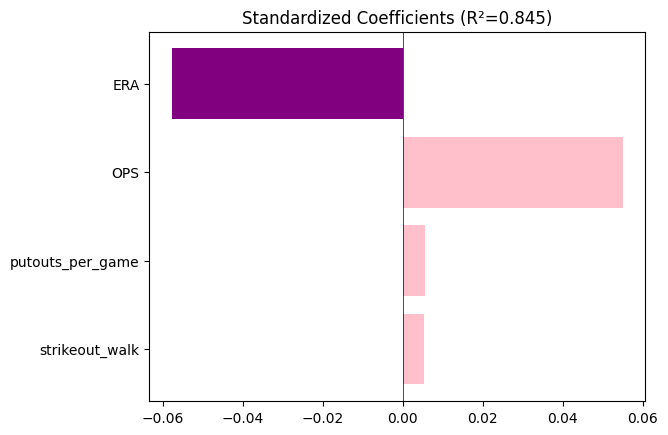
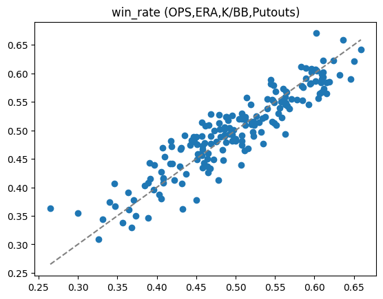

# KBO 팀 승률 다요인 분석 (Part 2): 투수·타자 데이터 통합

*[Read in English](README2.md)*

[Part 1 — KBO 수비력과 팀 성적의 관계 분석](https://github.com/BoYoung1233/KBO_defense_analysis)의 후속 프로젝트입니다. Part 1에서는 수비 지표만으로 승률을 분석했으나 설명력이 제한적이었습니다. 이번 프로젝트는 투수·타자 데이터를 통합해 그 한계를 보완하고, 수비·투수·타자 중 무엇이 승률에 더 중요한지 살펴봅니다.

- **분석 기간**: 2001–2021 (투수·타자·수비 데이터 교집합)
- **분석 단위**: 팀-시즌 (184건, 11개 프랜차이즈)

## 데이터 출처

| 항목 | 출처 |
|---|---|
| 수비 기록 (2001–2024) | Part 1 산출물, Kaggle 기반 |
| 투수 기록 (1982–2021) | Kaggle, `kbopitchingdata.csv` |
| 타자 기록 (1982–2021) | Kaggle, `kbobattingdata.csv` |
| 정규시즌 승률 | KBO 공식 홈페이지 (교차검증용) |

## 분석 과정

- 프랜차이즈 개명 이력에 따라 팀명 통일 (예: SK Wyverns/SSG Landers → Incheon)
- 세 데이터셋 병합 및 검증 (`outer` join + `indicator` 확인 후 `inner` join); 투수 데이터의 games 카운트 오류로 인한 승률 불일치 발견 및 수정
- 카테고리별(수비/투수/타자) 상관행렬로 다중공선성 높은 지표 제거 후 대표 지표 선정
- 대표 지표 표준화(z-score) 후 다중회귀 진행
- 보너스 분석: DIPS 이론(FIP-ERA gap), 피타고리안 잔차분석, 득점력 vs 실점억제력 지수 비교

## 주요 결과

**1. 다중회귀** — ERA, K/BB, OPS, putouts_per_game 4개 지표로 승률 변동의 **84.5%**를 설명 (R²=0.845), Part 1의 수비 단독 모델(R²≈0.31) 대비 크게 개선됐습니다. ERA와 OPS가 가장 강하고 유의미한 예측 변수였습니다.




**2. DIPS 이론 (FIP-ERA gap)** — gap이 가장 컸던 팀은 NC Dinos 2014(+0.791), 가장 작았던 팀은 Kia Tigers 2013(-0.788)이었습니다. putouts_per_game과 대조했을 땐 두 극단 사례 간 차이가 거의 없었는데(26.6 vs 26.8), putouts_per_game이 경기 규칙상 어느 정도 고정된 값이고 삼진(투수 능력)까지 포함하기 때문이었습니다. 대신 BABIP과는 뚜렷한 관계를 보였습니다 — gap이 클수록 BABIP가 낮고, 작을수록 높았습니다(r=-0.48, putouts_per_game의 r=0.40보다 강함).

**3. 피타고리안 잔차분석** — 동일 팀 안에서도 시즌마다 잔차가 크게 달라져(예: 역대 최약체 이미지인 Hanwha Eagles가 평균 잔차 1위), 잔차가 팀의 고정된 특성이 아님을 확인했습니다. 잔차는 세이브와 약하게(r=0.29), FIP-ERA gap과는 거의 무관(r=-0.15)하게 나타났습니다.

**4. 득점력 vs 실점억제력** — 두 지수만으로 R²=0.726. z-score 평균 시 발생하는 표준편차 압축을 보정한 결과, 실점억제력이 득점력보다 약 **1.58배** 더 강하게 작용했습니다.

## 한계

- 세이브 데이터가 raw count이고 세이브 기회·경기 단위 데이터가 없어 접전 상황 분석에 한계
- 투수·타자 데이터가 2021년까지만 존재 (2022–2024 제외)
- wOBA는 KBO 전용 가중치 부재로 OPS로 대체
- putouts_per_game과 ERA의 약한 상관(-0.47)으로 두 지표 기여도가 일부 겹칠 가능성
- FIP 상수는 공식 계수가 아닌 리그 평균 역산치

자세한 내용과 향후 개선 방향은 노트북을 참고해주세요.

## 사용 도구

Python (pandas, statsmodels, scipy.stats, matplotlib, seaborn), Jupyter Notebook

## Repository Structure

```
├── KBO2.ipynb
├── README2.md
├── README_KOR2.md
├── image2/
└── data/
```

## Related

- [Part 1 — KBO 수비력과 팀 성적의 관계 분석](https://github.com/BoYoung1233/KBO_defense_analysis)
